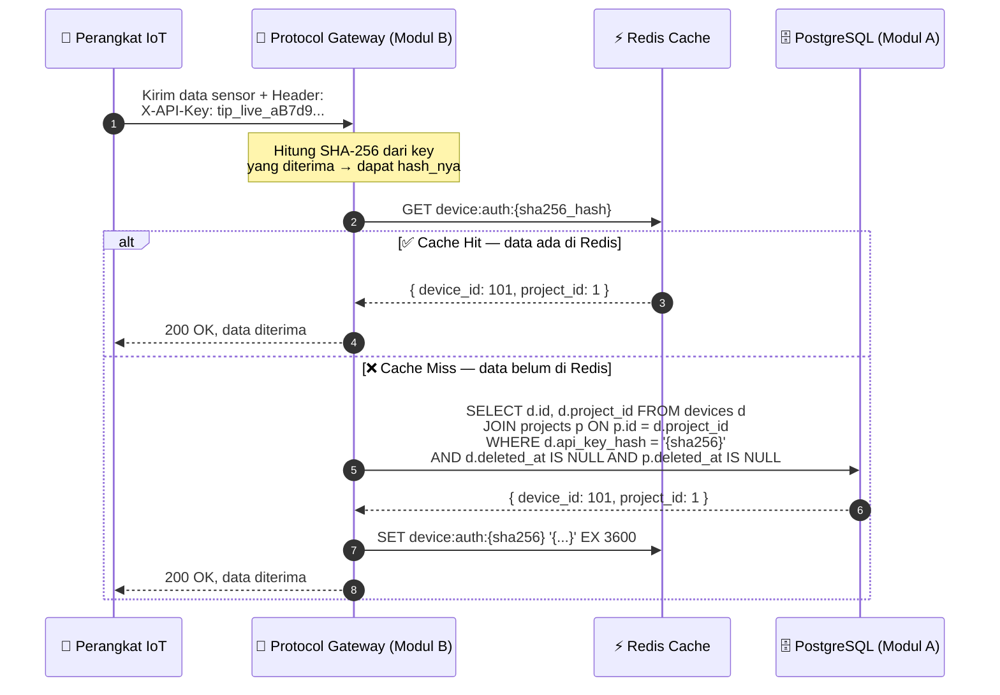

# 🔑 Spesifikasi Format API Key Perangkat — Modul A

Dokumen ini menjelaskan bagaimana sistem membuat, menyimpan, dan memverifikasi API Key perangkat IoT. Dokumen ini merupakan **kesepakatan teknis antara Modul A (pembuat key) dan Modul B (pemakai key di Protocol Gateway)**.

---

## 🤔 Apa itu API Key Perangkat?

Bayangkan Anda punya kartu akses untuk masuk gedung kantor. Kartu itu unik, hanya milik Anda, dan bisa dicabut kapan saja oleh admin. API Key perangkat bekerja persis seperti itu:
- Setiap **Device** yang terdaftar di platform mendapatkan satu API Key unik.
- Key ini digunakan perangkat untuk "mengetuk pintu" gateway setiap kali mengirim data sensor.
- Jika perangkat hilang atau dicuri, key bisa **dicabut secara instan** oleh pemilik proyek.

---

## 📐 Format API Key

```
tip_live_aB7d9K3mFp2qRt5yWx8zN4vJ1sL6pQ9e
```

| Bagian | Contoh | Fungsi |
|---|---|---|
| **Prefix** | `tip_live_` | Menandai bahwa ini token IoT Platform (mudah dikenali jika bocor ke repositori publik) |
| **Body** | 32 karakter acak | Entropi acak sangat tinggi, hampir mustahil ditebak |

**Cara membuat di backend:**
```python
# Python
import secrets
api_key = "tip_live_" + secrets.token_urlsafe(24)

# Node.js
const key = "tip_live_" + crypto.randomBytes(24).toString('base64url');
```

---

## 💾 Cara Penyimpanan di Database

> ⚠️ **Aturan Emas: Jangan PERNAH menyimpan API Key dalam bentuk teks asli (plain-text) di database.**

**Cara yang benar:**
1. Backend meng-generate API Key plain-text.
2. Backend menghitung **SHA-256 hash** dari key tersebut.
3. Hanya hash-nya yang disimpan ke kolom `api_key_hash` di tabel `devices`.
4. API Key plain-text ditampilkan ke user **hanya sekali** di response saat perangkat pertama kali dibuat.

**Mengapa SHA-256, bukan bcrypt?**

| Algoritma | Kecepatan | Cocok untuk |
|---|---|---|
| **bcrypt / Argon2** | Sangat lambat (sengaja) | Password manusia — perlu lambat karena password bisa ditebak dari kamus |
| **SHA-256** | Sangat cepat | API Key — tidak perlu lambat karena key sudah 32 karakter acak, mustahil ditebak |

Karena Protocol Gateway (Modul B) harus memverifikasi jutaan request per detik, SHA-256 adalah pilihan yang tepat.

---

## ⚡ Alur Verifikasi di Protocol Gateway (Koordinasi dengan Modul B)



### Detail Payload yang Disimpan di Redis Cache:
- **Key Redis**: `device:auth:{sha256_hash_hex}`
- **Value** (JSON String):
  ```json
  {
    "device_id": 101,
    "project_id": 1
  }
  ```
- **TTL (Masa Hidup Cache)**: 1 jam (`3600` detik) — setelah itu akan di-refresh otomatis dari DB saat request berikutnya

---

## 🚫 Cara Mencabut Akses Perangkat (Revocation)

Jika perangkat dihapus oleh pemilik proyek melalui API `DELETE /api/v1/projects/{projectId}/devices/{deviceId}`:

**Apa yang terjadi di backend (Modul A):**
1. **Soft-delete device** di PostgreSQL: `UPDATE devices SET deleted_at = now() WHERE id = ?`
2. **Trigger database otomatis** menonaktifkan semua alert rule milik device ini (`is_active = false`)
3. **Hapus cache** di Redis: `DEL device:auth:{sha256_hash_hex}`

**Mengapa langkah 3 penting?**
- Tanpa menghapus cache, perangkat yang sudah dihapus masih bisa mengirim data selama 1 jam (sampai cache kadaluarsa secara alami).
- Dengan menghapus cache, pencabutan akses langsung berlaku instan di request berikutnya.

**Alur setelah revocation:**
```
Perangkat kirim data → Gateway hitung hash → Cek Redis → Cache Miss
→ Query DB → Device ditemukan tapi deleted_at IS NOT NULL → TOLAK
→ Kirim 401 Unauthorized ke perangkat
```

---

## 📋 Ringkasan Keputusan untuk Koordinasi dengan Modul B

| Topik | Keputusan |
|---|---|
| **Format key** | `tip_live_` + 32 karakter acak (`secrets.token_urlsafe`) |
| **Algoritma hash** | SHA-256 (cepat, aman untuk high-entropy key) |
| **Lokasi hash di DB** | Kolom `api_key_hash` di tabel `devices` (UNIQUE) |
| **Cache verifikasi** | Redis key `device:auth:{hash}` dengan TTL 1 jam |
| **Pencabutan akses** | Soft-delete DB + hapus Redis cache → efektif instan |
| **Header pengiriman** | `X-API-Key: tip_live_xxxxx...` di setiap HTTP request sensor |
| **Waktu sepakat** | Checkpoint Minggu 3 bersama Mahasiswa B |
