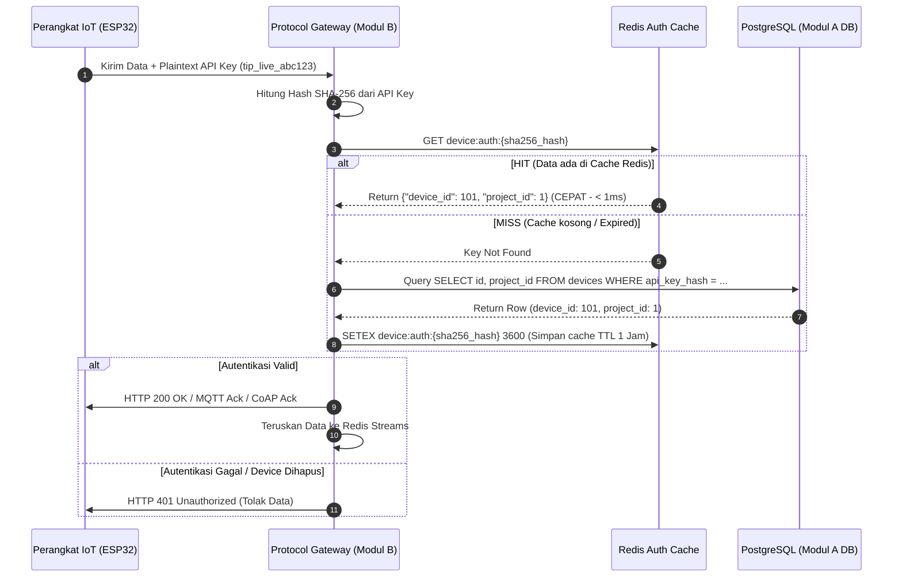
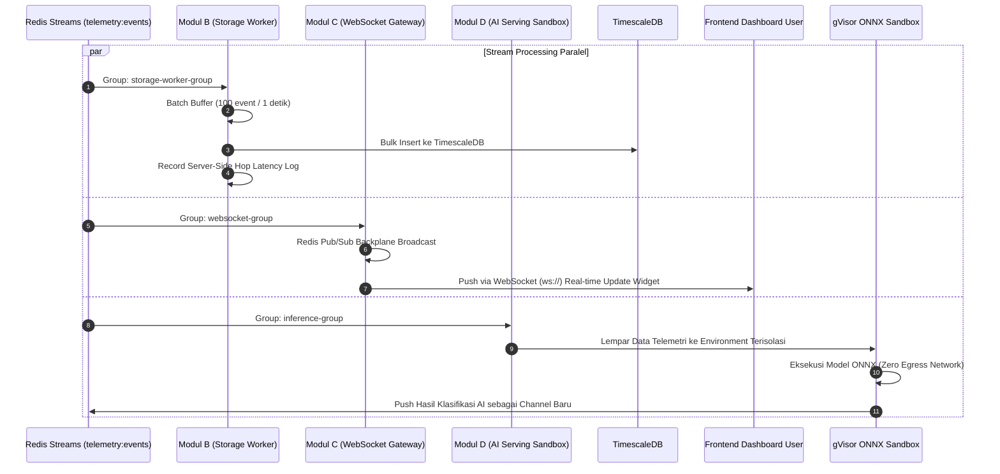

# 🔌 Dokumentasi Alur Protokol Lengkap (Protocol Flow) — Platform IoT Multi-Tenant

> **Proyek:** Telecom Infra Project (TIP) — Platform IoT Multi-Tenant  
> **Tujuan:** Panduan lengkap mengenai seluruh alur protokol komunikasi, autentikasi, normalisasi data, hingga distribusi notifikasi dan AI dengan bahasa yang intuitif dan mudah dipahami.

---

## 📋 Daftar Isi Protokol

1. [🌐 Overview 5 Lapisan Alur Protokol (High-Level Summary)](#1-overview-5-lapisan-alur-protokol-high-level-summary)
2. [📱 Lapisan 1: Protokol Komunikasi Perangkat IoT (HTTP, MQTT, CoAP)](#2-lapisan-1-protokol-komunikasi-perangkat-iot-http-mqtt-coap)
3. [🔑 Lapisan 2: Protokol Autentikasi & Revokasi Kredensial Perangkat](#3-lapisan-2-protokol-autentikasi--revokasi-kredensial-perangkat)
4. [⚡ Lapisan 3: Protokol Event Bus & Normalisasi (Redis Streams)](#4-lapisan-3-protokol-event-bus--normalisasi-redis-streams)
5. [🚨 Lapisan 4: Protokol Alert Engine & Pengiriman Notifikasi (Modul A)](#5-lapisan-4-protokol-alert-engine--pengiriman-notifikasi-modul-a)
6. [📡 Lapisan 5: Protokol Real-Time Dashboard, Storage, & AI Serving (Modul B, C, D)](#6-lapisan-5-protokol-real-time-dashboard-storage--ai-serving-modul-b-c-d)

---

## 1. 🌐 Overview 5 Lapisan Alur Protokol (High-Level Summary)

Secara sederhana, data bergerak melalui **5 Lapis Protokol** dari sensor fisik hingga sampai ke layar HP atau dashboard pengguna:

```
[ Sensor / ESP32 ] 
       │ 
       ├─► HTTP POST (Port 3000) ────┐
       ├─► MQTT Publish (Port 1884) ──┼──► [ Protocol Gateway ] (Modul B)
       └─► CoAP UDP (Port 5683) ─────┘           │
                                                 ▼ (Cek Redis Cache & Auth SHA-256)
                                         [ Standard Event JSON ]
                                                 │
                                                 ▼ (Push to Stream)
                                        ⚡ [ Redis Streams ] (telemetry:events)
                                                 │
      ┌──────────────────────┬───────────────────┼──────────────────────┐
      ▼                      ▼                   ▼                      ▼
[ Modul A ]            [ Modul B ]         [ Modul C ]            [ Modul D ]
Alert Engine           Storage Worker      WebSocket Gateway      AI Inference Sandbox
+ Redis Cooldown       (TimescaleDB)       + Redis Pub/Sub        (gVisor ONNX)
+ Notification         + Hop Metrics       (Dashboard Real-time)  (Hasil ke DB/Channel)
```

---

## 2. 📱 Lapisan 1: Protokol Komunikasi Perangkat IoT (HTTP, MQTT, CoAP)

Platform kami mendukung **3 protokol jaringan** pada Protocol Gateway (Modul B) agar perangkat jenis apa pun (dari mikrokontroler murah hingga gateway industri) bisa terhubung.

### A. Protokol HTTP REST API (Model Web Request)
* **Penggunaan**: Cocok untuk perangkat yang punya daya stabil dan koneksi WiFi/LAN.
* **Port**: `3000`
* **Endpoint**: `POST /api/v1/telemetry`
* **Format Header**: `x-api-key: tip_live_xxxxx`
* **Cara Kerja**:
  1. ESP32 membuka koneksi TCP ke server Gateway.
  2. ESP32 mengirim HTTP POST dengan body JSON:
     ```json
     {
       "device_id": "esp32-sensor-01",
       "temperature": 28.5,
       "humidity": 60.0
     }
     ```
  3. Server merespon HTTP `200 OK` dan menutup koneksi.

---

### B. Protokol MQTT (Model Publisher-Subscriber)
* **Penggunaan**: Sangat hemat bandwidth dan energi, cocok untuk sensor yang mengirim data terus menerus.
* **Port**: `1884`
* **Topic**: `telemetry/data`
* **Cara Kerja**:
  1. ESP32 melakukan **CONNECT** ke Broker MQTT dengan parameter:
     * `Client ID`: `esp32-sensor-01`
     * `Username`: `esp32-sensor-01`
     * `Password`: `tip_live_xxxxx` (API Key Perangkat)
  2. Setelah terhubung (*ConnAck*), ESP32 melakukan **PUBLISH** data JSON ke topic `telemetry/data`.
  3. Koneksi tetap terbuka (*Keep-Alive*) tanpa perlu jabat tangan berulang kali.

---

### C. Protokol CoAP UDP (Constrained Application Protocol)
* **Penggunaan**: Protokol ultra-ringan berbasis UDP (tanpa jabat tangan TCP berat), cocok untuk perangkat berdaya baterai atau koneksi seluler hemat data.
* **Port**: `5683 (UDP)`
* **Resource Path**: `POST /telemetry`
* **Header Auth**: Option Header `authorization: tip_live_xxxxx`
* **Cara Kerja**:
  1. ESP32 langsung melempar paket UDP CoAP POST ke IP server tanpa menunggu koneksi TCP terbentuk.
  2. Gateway merespon dengan paket ACK pendek.

---

## 3. 🔑 Lapisan 2: Protokol Autentikasi & Revokasi Kredensial Perangkat

Setiap data yang masuk ke Gateway wajib diverifikasi keasliannya sebelum diproses lebih jauh.

### Flowchart Protokol Autentikasi Perangkat



---

### 🛡️ Protokol Revokasi Akses Instan (Instant Revocation Protocol)
Bagaimana jika pengguna **menghapus perangkat** di Modul A?
1. Backend Modul A memperbarui database (`deleted_at = NOW()`).
2. Modul A langsung memanggil perintah Redis:
   ```bash
   DEL device:auth:{sha256_hash}
   ```
3. Saat perangkat IoT mencoba mengirim data 1 detik kemudian, Gateway menemukan bahwa cache di Redis sudah lenyap. Query ke DB juga menolak karena `deleted_at` sudah terisi.
4. **Hasil**: Access terputus secara **real-time** tanpa perlu menunggu TTL 1 jam selesai!

---

## 4. ⚡ Lapisan 3: Protokol Event Bus & Normalisasi (Redis Streams)

Gateway mengubah data mentah dari berbagai protokol menjadi satu **Standard Event JSON** seragam.

### Struktur Standard Event JSON
```json
{
  "event_id": "1723620000000-0",
  "device_id": 101,
  "project_id": 1,
  "channel_name": "temperature",
  "value": 34.8,
  "channel_type": "numeric",
  "timestamps": {
    "gateway_received": 1723620000100,
    "stream_enqueued": 1723620000105
  }
}
```

### Protokol Redis Streams (`telemetry:events`)
Gateway memasukkan event tersebut ke stream dengan perintah:
```bash
XADD telemetry:events * device_id 101 project_id 1 channel_name temperature value 34.8 channel_type numeric ...
```

---

## 5. 🚨 Lapisan 4: Protokol Alert Engine & Pengiriman Notifikasi (Modul A)

Modul A mendengarkan Redis Streams menggunakan Consumer Group `alert-engine-group`.

### Flowchart Protokol Alert & Anti-Spam (Redis Cooldown)

```mermaid
flowchart TD
    Start([Event Telemetri Masuk dari Redis Streams]) --> ReadGroup[XREADGROUP Group: alert-engine-group]
    ReadGroup --> MatchRule{Apakah Nilai Melewati Threshold Rule?}
    
    MatchRule -- Tidak --> ACK[Kirim XACK ke Redis Stream]
    MatchRule -- Ya --> CheckCooldown{Exec: SET alert:cooldown:RULE_ID 1 NX EX SECONDS}
    
    CheckCooldown -- Return nil (Masih Cooldown) --> ACK
    CheckCooldown -- Return OK (Cooldown Selesai) --> Dispatch[Dispatch Notifikasi Asinkron]
    
    Dispatch --> ChType{Tipe Target Notifikasi}
    ChType -- Telegram --► SendTelegram[Telegram Bot API: sendMessage]
    ChType -- Email --► SendEmail[SMTP Server: Send Mail]
    ChType -- Webhook --► SendWebhook[HTTP POST + Header HMAC SHA-256 Signature]
    
    SendTelegram --> ACK
    SendEmail --> ACK
    SendWebhook --> ACK
    ACK --> End([Selesai Processing Event])
```

---

### 🔒 Protokol Keamanan Webhook (HMAC Signature Header)
Untuk memastikan server pengguna tidak menerima webhook palsu:
1. Modul A menghitung signature pesan:
   $$\text{Signature} = \text{HMAC-SHA256}(\text{Payload JSON}, \text{Secret Key User})$$
2. Header dikirimkan pada request HTTP:
   ```http
   POST /webhook-endpoint HTTP/1.1
   Host: my-user-server.com
   Content-Type: application/json
   X-TIP-Signature: sha256=a7f9b8c2d1e...
   ```
3. Server pengguna memverifikasi signature tersebut sebelum menerima data.

---

## 6. 📡 Lapisan 5: Protokol Real-Time Dashboard, Storage, & AI Serving (Modul B, C, D)

Tiga modul lainnya mengonsumsi data yang sama dari Redis Streams secara paralel:



---

### 📝 Ringkasan 4 Keunggulan Alur Protokol Proyek Ini

1. **Anti-Blocking (Asinkron & Ter-decouple)**: Berkat **Redis Streams Consumer Groups**, jika pengiriman email di Modul A lambat atau AI Modul D butuh waktu inferensi, pemrosesan grafik di Dashboard (Modul C) dan penyimpanan data (Modul B) tetap kencang tanpa hambatan.
2. **Kinerja Tinggi (< 1 ms Auth)**: Autentikasi perangkat berbasis hash SHA-256 yang di-cache di Redis menjamin Gateway dapat menerima puluhan ribu data per detik.
3. **Keamanan Bertingkat**:
   * API Key Perangkat $\rightarrow$ Hash SHA-256 + Redis Instant Revocation.
   * Isolasi Tenant Database $\rightarrow$ Composite Foreign Key `project_id`.
   * Webhook Notifikasi $\rightarrow$ HMAC SHA-256 Signature Header.
   * AI Inference $\rightarrow$ gVisor/nsjail Sandbox dengan Zero Network Egress.
4. **Log Performa Transparan**: Pencatatan latensi *hop-by-hop* dilakukan murni di sisi server untuk menghasilkan metrics riset yang valid dan akurat.

---
*Dokumentasi alur protokol ini dibuat khusus untuk mempermudah pemahaman arsitektur komunikasi platform.*
