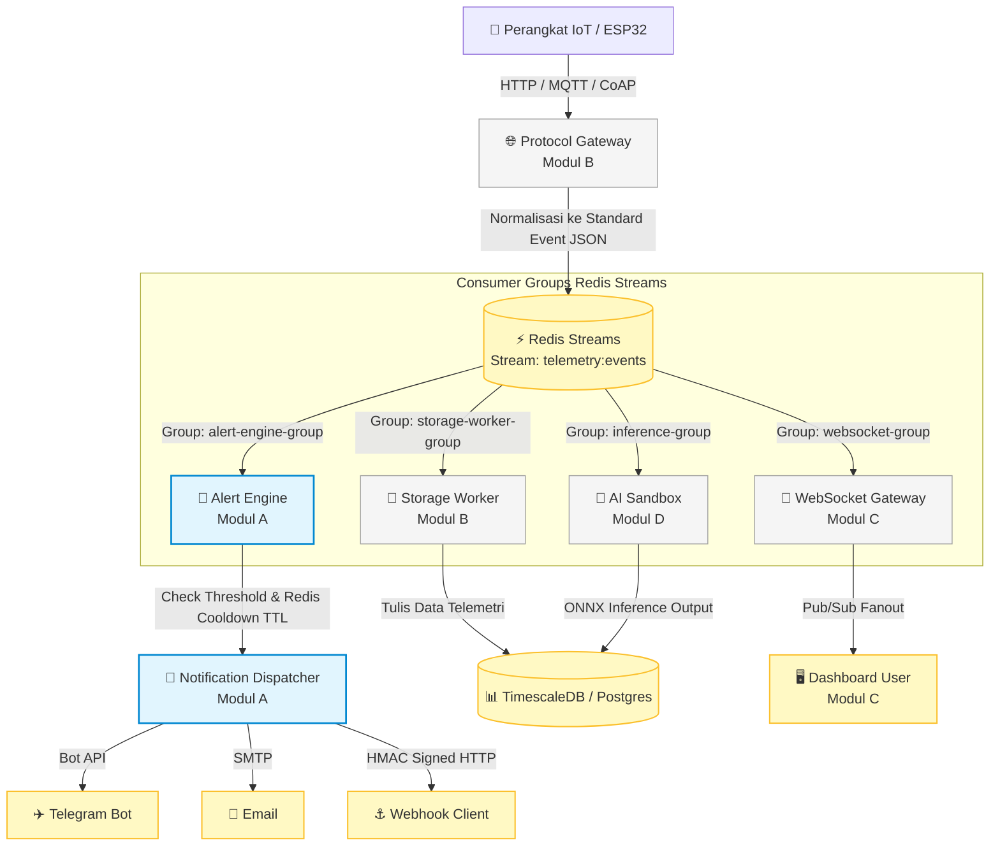
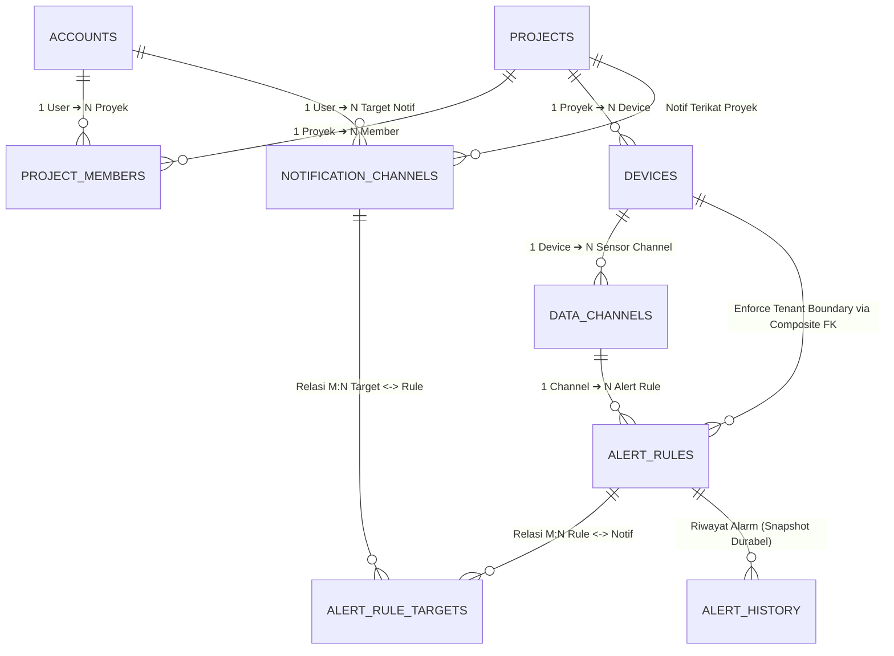

# 🚀 Panduan & Bahan Presentasi Lengkap: Platform IoT Multi-Tenant
> **Proyek:** Telecom Infra Project (TIP) — Platform IoT Multi-Tenant Berbasis Event-Driven Architecture  
> **Fokus Utama:** Modul A (Authentication, Hierarchy, Alert Engine, Notification Dispatcher)  
> **Bahasa:** Bahasa Indonesia (Mudah dipahami, komunikatif, profesional, dan siap dipresentasikan)

---

## 📋 Daftar Isi

1. [📌 Ringkasan Eksekutif & Analogi Sederhana](#1-ringkasan-eksekutif--analogi-sederhana)
2. [🏗️ Arsitektur Sistem & Aliran Data End-to-End](#2-arsitektur-sistem--aliran-data-end-to-end)
3. [🎯 Pembagian Modul & Tanggung Jawab Tim](#3-pembagian-modul--tanggung-jawab-tim)
4. [💾 Rancangan Database & Keunggulan Keamanan Teknis](#4-rancangan-database--keunggulan-keamanan-teknis)
5. [⚡ Detail Mekanisme Kerja Modul A](#5-detail-mekanisme-kerja-modul-a)
6. [🤝 Matriks Integrasi Lintas Modul (A, B, C, D)](#6-matriks-integrasi-lintas-modul-a-b-c-d)
7. [🎤 Panduan Presentasi Slide-by-Slide & Script Bicara](#7-panduan-presentasi-slide-by-slide--script-bicara)
8. [❓ Q&A Cheat Sheet (Bocoran Pertanyaan Penguji & Jawaban)](#8-qa-cheat-sheet-bocoran-pertanyaan-penguji--jawaban)

---

## 1. 📌 Ringkasan Eksekutif & Analogi Sederhana

### Latar Belakang Proyek
Platform ini dirancang sebagai **Platform IoT Multi-Tenant** berkemampuan tinggi yang memiliki dua fungsi utama:
1. **Tugas Besar Kelompok**: Dikembangkan oleh 4 mahasiswa secara kolaboratif (Modul A, B, C, dan D).
2. **Infrastruktur Riset Kampus**: Menyediakan API export log performa agar mahasiswa lain dapat memanfaatkannya untuk riset Tugas Akhir (TA) mereka sendiri.

---

### 💡 Analogi Sederhana: Konsep "Co-Working Space"
Untuk mempermudah dosen, penguji, atau audiens memahami sistem ini dalam **10 detik**, bayangkan platform IoT ini seperti **Gedung Co-Working Space**:

```
[Akun Pengguna / User Account]
       │ (kartu akses gedung)
       ▼
[Proyek / Projects]  ────────► Ruangan Kantor yang Disewa (Tenant)
       │
       ▼
[Perangkat / Devices] ──────► Peralatan Pintar di Ruangan (Misal: AC Pintar)
       │
       ▼
[Kanal Data / Channels] ────► Sensor Spesifik (Misal: Sensor Suhu AC)
       │
       ▼
[Aturan Peringatan / Rules] ─► Saklar Otomatis (Jika suhu > 30°C ➔ Pemicu Alarm)
       │
       ▼
[Media Notifikasi] ─────────► Panggilan Darurat ke Telegram / Email Pengguna
```

* **Tenant Boundary (Batas Akses)**: Pengguna dari Ruangan A **tidak bisa** melihat atau mematikan AC di Ruangan B.
* **Satpam Durabel (Alert History)**: Setiap alarm berbunyi, kejadiannya dicatat di buku jurnal satpam yang **tidak bisa dihapus**, bahkan jika saklar alarmnya kemudian dirusak/dihapus oleh pengguna.

---

## 2. 🏗️ Arsitektur Sistem & Aliran Data End-to-End

Platform menggunakan **Event-Driven Architecture (EDA)** dengan **Redis Streams** sebagai *message bus* utama. Pendekatan ini membuat setiap modul dapat bekerja secara mandiri (*decoupled*) tanpa saling membebani.

### Diagram Alir Data Sistem (End-to-End)



---

### 🔑 Keputusan Arsitektur Kunci (Architectural Decisions)

| Keputusan Arsitektur | Alasan Teknis & Keunggulan |
| :--- | :--- |
| **Shared Schema (Kolom `tenant_id`)** | Mengabaikan pendekatan *Database-per-tenant* untuk menghemat memori server dan koneksi database. Keamanan dijamin lewat **Composite Foreign Key** dan **Row-Level Filters**. |
| **Hybrid Database (Postgres + TimescaleDB)** | PostgreSQL menangani data terstruktur (User, Project, Device, Rules), sedangkan TimescaleDB (ekstensi PostgreSQL) menangani *time-series telemetry* agar query data historis tetap sangat cepat. |
| **Redis Streams Consumer Groups** | Jika pemrosesan AI (Modul D) lambat atau crash, deteksi alert (Modul A) dan penyimpanan data (Modul B) tetap berjalan lancar tanpa mengalami *blocking*. |
| **Server-Side Hop Timestamp** | Pencatatan delay/latensi dilakukan murni di sisi server pada setiap tahap pemrosesan untuk menjamin keakuratan pengukuran tanpa bergantung pada sinkronisasi jam perangkat IoT. |

---

## 3. 🎯 Pembagian Modul & Tanggung Jawab Tim

| Modul | Pemilik | Scope & Tanggung Jawab Utama |
| :---: | :---: | :--- |
| **Modul A** | **Anda (Presenter)** | <ul><li>Autentikasi Pengguna & Kredensial Perangkat (API Key).</li><li>Pengelolaan Hierarki Data (`Account ➔ Project ➔ Device ➔ Channel`).</li><li>Mesin Evaluasi Ambang Batas Peringatan (*Alert Rule Engine*).</li><li>Pengirim Notifikasi Asinkron (*Telegram, Email, Webhook*).</li></ul> |
| **Modul B** | Mahasiswa B | Protocol Gateway (HTTP, MQTT, CoAP), Normalisasi Format Data, Storage Worker (TimescaleDB), dan Log Metrics Performa. |
| **Modul C** | Mahasiswa C | Visualisasi Widget Dashboard, WebSocket Real-time Push (Redis Pub/Sub), dan Export Log Performa Riset. |
| **Modul D** | Mahasiswa D | Upload & Validasi Model AI (ONNX Format), AI Inference Sandbox (gVisor/nsjail), dan External AI API Integration. |

---

## 4. 💾 Rancangan Database & Keunggulan Keamanan Teknis

Rancangan database relasional PostgreSQL untuk Modul A mencakup **9 tabel** yang dirancang presisi untuk menjamin keamanan level database.

### Diagram Relasi Database (ERD)



---

### 🛡️ 5 Keunggulan Keamanan & Desain Basis Data

#### 1. Jaminan Isolasi Tenant Melalui Composite Foreign Key
Data antar-proyek **dilarang keras** tercampur. 
* **Teknologi**: Tabel `alert_rules` menggunakan Foreign Key komposit `FOREIGN KEY (device_id, project_id) REFERENCES devices(id, project_id)`.
* **Keunggulan**: Jika ada bug di backend yang mencoba memasang aturan alarm dari Project A ke Device milik Project B, **PostgreSQL akan langsung menolak operasi tersebut di tingkat basis data**.

#### 2. Denormalisasi Terkendali untuk Kinerja Tinggi
Perangkat mengirimkan jutaan data telemetri. Data masuk ke Redis Streams hanya membawa `device_id`.
* **Teknologi**: Kolom `device_id` disimpan langsung di tabel `alert_rules` (denormalisasi).
* **Keunggulan**: Evaluasi alert tidak memerlukan operasi `JOIN` berat ke tabel `data_channels` dan `devices`. Keabsahan data tetap terjamin 100% via constraint `UNIQUE(id, device_id)` pada `data_channels`.

#### 3. Fleksibilitas Akses M:N dengan Pembatasan Single Owner
* **Teknologi**: Menggunakan tabel penghubung `project_members` dilengkapi *Partial Unique Index*:
  ```sql
  CREATE UNIQUE INDEX one_owner_per_project 
  ON project_members (project_id) WHERE role = 'owner';
  ```
* **Keunggulan**: Proyek saat ini dibatasi 1 Owner. Namun jika nanti sistem dikembangkan untuk menambah role `collaborator` atau `viewer`, **tidak perlu mengubah struktur tabel sama sekali**.

#### 4. Riwayat Audit Durabel (Tahan Penghapusan)
* **Teknologi**: Menggunakan `ON DELETE SET NULL` pada `alert_history.alert_rule_id` serta trigger `populate_alert_history_context`.
* **Keunggulan**: Ketika pengguna menghapus sebuah aturan alarm, catatan sejarah kapan alarm itu pernah berbunyi **tetap tersimpan rapi** dalam bentuk snapshot JSONB.

#### 5. Email Unik Hanya untuk Akun Aktif (Soft-Delete Friendly)
* **Teknologi**: *Partial Index* pada tabel `accounts`:
  ```sql
  CREATE UNIQUE INDEX uq_accounts_active_email 
  ON accounts (lower(email)) WHERE deleted_at IS NULL;
  ```
* **Keunggulan**: Pengguna dapat menghapus akunnya (*soft-delete*), dan di kemudian hari email yang sama **dapat digunakan kembali** untuk mendaftar akun baru tanpa bentrok constraint.

---

## 5. ⚡ Detail Mekanisme Kerja Modul A

### A. Autentikasi User & Kredensial Perangkat (API Key)
1. **Password User**: Di-hash menggunakan algoritma **Bcrypt** / **Argon2** (aman dari serangan dictionary attack).
2. **API Key Perangkat**:
   * Format: Token acak 32 karakter ber-entropi tinggi dengan prefix `tip_live_xxxxx`.
   * Di-hash menggunakan **SHA-256** di database (`api_key_hash`). Plaintext key hanya diperlihatkan **sekali** saat pembuatan device.
3. **Mekanisme Caching & Instan Revocation (Kolaborasi Modul B)**:
   * Saat perangkat connect pertama kali, Protocol Gateway memverifikasi hash ke DB lalu menyimpan hasilnya di **Redis Cache**:
     `Key: device:auth:{sha256_hash}` ➔ `Value: {"device_id": 101, "project_id": 1}` (TTL = 1 Jam).
   * Jika device dihapus oleh pengguna di Modul A, sistem memanggil `DEL device:auth:{hash}` di Redis. **Akses perangkat terputus secara instant saat itu juga!**

---

### B. Mesin Evaluasi Alert & Anti-Spam (Redis Cooldown)
Ketika telemetri masuk dari Redis Streams:
1. System mengevaluasi nilai sensor terhadap threshold (`>`, `<`, `>=`, `<=`, `==`).
2. Jika threshold terlampaui, sistem menjalankan mekanisme **Redis TTL Key (Atomic Lock)** untuk mencegah spam notifikasi:
   ```bash
   SET alert:cooldown:{rule_id} 1 NX EX {cooldown_seconds}
   ```
   * Jika Redis mengembalikan `OK`: Notifikasi **dikirim**, dan cooldown aktif selama `X` detik.
   * Jika Redis mengembalikan `nil`: Berarti notifikasi baru saja dikirim sebelumnya (masih masa cooldown), notifikasi **di-skip**.

> **Catatan Keamanan**: Lock Redis dipasang **sebelum** notifikasi dikirim agar jika proses pengiriman crash/retry, tidak ada notifikasi ganda yang terkirim.

---

### C. Pengirim Notifikasi Asinkron (Notification Dispatcher)
* **Redis Streams Consumer**: Menggunakan group `alert-engine-group` dengan mekanisme `XREADGROUP`.
* **Proses Pengiriman**:
  * **Telegram Bot API**: Mengirim pesan terformat ke `chat_id` pengguna.
  * **Email SMTP**: Mengirim pesan via server SMTP.
  * **Webhook**: Mengirim HTTP POST ke server pengguna dilengkapi **Header HMAC Signature** (`X-TIP-Signature`) agar penerima bisa memverifikasi bahwa pesan berasal dari platform resmi.
* **Handshake Reliability**: Setelah notifikasi terkirim, worker mengirim sinyal `XACK`. Jika worker crash sebelum `XACK`, saat restart worker membaca perintah `XPENDING` untuk memproses ulang pesan yang tertunda.

---

## 6. 🤝 Matriks Integrasi Lintas Modul (A, B, C, D)

| Koordinasi | Modul Terkait | Detail Kesepakatan Kontrak Integrasi |
| :--- | :---: | :--- |
| **API Key & Auth Caching** | **Modul B** (Gateway) | Modul A menyediakan endpoint hash check & mengelola Redis Cache Revocation `device:auth:{hash}` saat device di-delete. |
| **Payload Event Telemetri** | **Modul B** (Gateway) | Modul B menjamin Redis Streams berisi JSON standar minimal: `{"device_id": 101, "channel_name": "temp", "value": 32.5, "timestamp": "..."}`. |
| **Tipe Kanal Sensor** | **Modul C** (Dashboard) | Endpoint `GET /devices/{id}/channels` Modul A mengembalikan `channel_type` (`numeric`, `boolean`, `geo`, `image`, `text`) agar Modul C tahu widget mana yang cocok dipasang. |
| **Batas Resource Tier AI** | **Modul D** (AI Serving) | Modul D membaca kolom `accounts.tier` (`free`/`paid`) langsung dari database Postgres atau Redis Cache untuk menerapkan pembatasan CPU/Memory di sandbox gVisor. |
| **Hasil Inferensi AI** | **Modul D** (AI Serving) | Hasil olahan AI dari Modul D dimasukkan kembali sebagai kanal data standar (`channel_type = 'text'/'numeric'`) sehingga Alert Engine Modul A bisa mendeteksi alert dari hasil AI secara otomatis! |

---

## 7. 🎤 Panduan Presentasi Slide-by-Slide & Script Bicara

Gunakan panduan di bawah ini saat membuat slide presentasi PowerPoint / Canva dan latihan berbicara.

---

### 📊 Slide 1: Judul & Latar Belakang
* **Visual Slide**: Judul Proyek "Platform IoT Multi-Tenant Berbasis Event-Driven Architecture", Nama Tim, & Diagram Co-Working Space.
* **Script Bicara (Presenter)**:
  > *"Selamat pagi/siang Bapak/Ibu Dosen Penguji. Hari ini kami mempresentasikan proyek Platform IoT Multi-Tenant. Platform ini kami rancang bukan hanya untuk memenuhi tugas mata kuliah, tetapi juga sebagai platform riset terbuka bagi mahasiswa lain. Untuk mempermudah pemahaman, platform ini bekerja persis seperti Gedung Co-Working Space, di mana setiap pengguna memiliki ruang proyeknya sendiri secara terisolasi dan aman."*

---

### 📊 Slide 2: Arsitektur Utama (Event-Driven)
* **Visual Slide**: Diagram Mermaid Aliran Data (ESP32 ➔ Gateway B ➔ Redis Streams ➔ Consumer Groups A, B, C, D).
* **Script Bicara (Presenter)**:
  > *"Untuk menangani beban data IoT yang masif, kami menggunakan Event-Driven Architecture berbasis Redis Streams. Ketika perangkat mengirim data, Protocol Gateway milik Modul B memasukkannya ke Redis Streams. Dari sana, 4 modul pembaca—termasuk Alert Engine milik Modul A—membaca data secara independen. Artinya, jika proses AI di Modul D sedang sibuk, deteksi alarm di Modul A tidak akan pernah terhambat."*

---

### 📊 Slide 3: Pembagian Tugas & Ruang Lingkup Modul A
* **Visual Slide**: Matriks Tugas Modul A (Auth, Hierarchy, Alert Engine, Notification Dispatcher).
* **Script Bicara (Presenter)**:
  > *"Tanggung jawab utama saya di Modul A adalah menjadi benteng keamanan dan pusat komunikasi platform. Modul A menangani autentikasi akun dan perangkat, pengelolaan hierarki data dari akun hingga sensor, mesin evaluasi alarm otomatis, serta distribusi notifikasi ke Telegram, Email, dan Webhook."*

---

### 📊 Slide 4: Hierarki Data & Keunggulan Database
* **Visual Slide**: Diagram ERD 9 Tabel & Highlight Composite Foreign Key.
* **Script Bicara (Presenter)**:
  > *"Di sisi basis data, kami menggunakan PostgreSQL yang dirancang sangat ketat. Kami menerapkan Composite Foreign Key yang mengunci 'project_id' pada setiap tabel. Keunggulannya, keamanan isolasi antar-tenant dijamin langsung di tingkat basis data. Bahkan jika terjadi bug di aplikasi backend, PostgreSQL akan menolak secara otomatis jika ada penyusupan data antar-proyek."*

---

### 📊 Slide 5: Fitur Unggulan Database (Soft-Delete & Audit Trail)
* **Visual Slide**: Perbandingan Tabel `accounts` (Partial Index) & `alert_history` (Snapshot JSONB).
* **Script Bicara (Presenter)**:
  > *"Selain itu, kami menerapkan Partial Unique Index untuk soft-delete. Pengguna yang menghapus akunnya dapat mendaftar kembali dengan email yang sama nanti. Kami juga menjamin durabilitas riwayat audit. Saat pengguna menghapus aturan alarm, catatan kejadian masa lalu di tabel 'alert_history' tidak akan hilang karena sistem otomatis menyimpan snapshot data alarm."*

---

### 📊 Slide 6: Autentikasi & Revokasi Instan API Key Perangkat
* **Visual Slide**: Alur Auth Perangkat (ESP32 ➔ SHA-256 Hash ➔ Redis Cache `device:auth`).
* **Script Bicara (Presenter)**:
  > *"Untuk keamanan perangkat IoT, kami menerbitkan API Key 32 karakter ber-entropi tinggi. Di database, kami hanya menyimpan hash SHA-256-nya. Demi performa tinggi, kredensial ini di-cache di Redis. Dan jika perangkat dihapus di Modul A, kunci Redis akan dihapus seketika, sehingga akses perangkat tersebut langsung terputus secara real-time."*

---

### 📊 Slide 7: Alert Engine & Anti-Spam (Redis Cooldown)
* **Visual Slide**: Flowchart Evaluasi Threshold ➔ Redis SET NX EX ➔ Dispatch Notification.
* **Script Bicara (Presenter)**:
  > *"Pada Alert Engine, saat sensor melewati batas threshold, sistem tidak langsung membombardir pengguna dengan pesan. Kami menggunakan mekanisme Redis Cooldown berbasis Atomic Lock TTL. Jika alarm terpicu, Redis mengunci aturan tersebut selama durasi tertentu. Hasilnya, pengguna terbebas dari spam notifikasi saat nilai sensor naik-turun di sekitar batas threshold."*

---

### 📊 Slide 8: Distribution Notifikasi (Telegram, Email, Webhook)
* **Visual Slide**: Diagram Worker Dispatcher ➔ Telegram Bot, Email SMTP, Webhook (HMAC Signature).
* **Script Bicara (Presenter)**:
  > *"Notifikasi dikirimkan secara asinkron via Telegram Bot API, SMTP Email, dan Webhook. Khusus untuk Webhook ke server pihak ketiga, kami menambahkan Header HMAC Signature. Ini memungkinkan sistem penerima memverifikasi secara matematis bahwa pesan tersebut benar-benar asli dari platform kami dan bukan kiriman pihak luar yang tidak dikenal."*

---

### 📊 Slide 9: Integrasi Lintas Modul
* **Visual Slide**: Tabel Matriks Integrasi A-B, A-C, A-D.
* **Script Bicara (Presenter)**:
  > *"Modul A terintegrasi sempurna dengan modul lain. Kami membagikan status Tier Akun ke Modul D untuk pembatasan resource AI, menyediakan tipe data kanal sensor ke Modul C untuk pemetaan widget dashboard, serta menyelaraskan kredensial API Key dengan Modul B."*

---

### 📊 Slide 10: Kesimpulan & Penutup
* **Visual Slide**: Poin Ringkasan Keunggulan System & Ucapan Terima Kasih.
* **Script Bicara (Presenter)**:
  > *"Kesimpulannya, Modul A berhasil menyediakan fondasi autentikasi yang aman, hierarki data yang tangguh, serta sistem alerting dan notifikasi yang andal serta efisien. Terima kasih atas perhatian Bapak/Ibu Dosen, kami siap menerima pertanyaan dan masukan."*

---

## 8. ❓ Q&A Cheat Sheet (Bocoran Pertanyaan Penguji & Jawaban)

Berikut adalah daftar pertanyaan yang paling sering ditanyakan dosen penguji beserta jawaban teknis terbaik yang harus Anda berikan:

#### ❓ Pertanyaan 1: "Mengapa menggunakan Shared Schema dengan kolom `tenant_id`? Mengapa tidak buat 1 Database terpisah untuk tiap tenant agar lebih aman?"
> **💡 Jawaban Terbaik**:  
> *"Pendekatan Database-per-Tenant membutuhkan overhead resource yang sangat besar di server karena memakan banyak koneksi database dan RAM. Untuk platform skala menengah dengan model freemium, Shared Schema jauh lebih efisien. Keamanan isolasi tenant kami jamin secara berlapis di tingkat database menggunakan Composite Foreign Key (project_id) dan Unique Constraint, sehingga PostgreSQL sendiri yang menolak jika ada akses lintas tenant."*

---

#### ❓ Pertanyaan 2: "Mengapa API Key Perangkat di-hash dengan SHA-256, bukan Bcrypt seperti password user?"
> **💡 Jawaban Terbaik**:  
> *"Password manusia umumnya pendek dan mudah ditebak sehingga butuh Bcrypt/Argon2 yang memiliki fungsi 'key stretching' (lambat) untuk mencegah brute-force. Sebaliknya, API Key perangkat dirancang secara otomatis dengan panjang 32 karakter acak (high entropy). SHA-256 sangat aman untuk string ber-entropi tinggi dan pemrosesannya jauh lebih cepat, sehingga tidak membebani Protocol Gateway saat memverifikasi ribuan perangkat IoT secara bersamaan."*

---

#### ❓ Pertanyaan 3: "Bagaimana jika Redis tempat menyimpan Redis Streams atau Redis Cooldown mengalami crash?"
> **💡 Jawaban Terbaik**:  
> *"Redis di-set dengan mekanisme persistensi RDB/AOF. Untuk Redis Streams, kami menggunakan Consumer Group dengan status `XPENDING`. Jika worker crash di tengah jalan, saat sistem restart, worker akan membaca pesan yang tertunda dan melanjutkan pemrosesan. Untuk Redis Cooldown, jika Redis restart dan key terhapus, efeknya hanya alarm akan terkirim sekali lagi saat threshold terlampaui, lalu kunci cooldown baru akan dibuat kembali secara otomatis."*

---

#### ❓ Pertanyaan 4: "Mengapa `channel_type` pada database menggunakan `TEXT + CHECK`, bukan `ENUM` bawaan Postgres?"
> **💡 Jawaban Terbaik**:  
> *"Di PostgreSQL, tipe data ENUM native bersifat kaku. Jika di masa depan kami ingin menambah tipe kanal baru—misalnya tipe 'audio' atau 'vector'—mengubah ENUM membutuhkan perintah DDL yang dapat memicu kunci tabel (table lock). Dengan menggunakan `TEXT` yang diberi `CHECK constraint`, kita cukup memperbarui constraint-nya secara instan tanpa mengganggu atau mengunci data yang sudah ada."*

---

#### ❓ Pertanyaan 5: "Bagaimana sistem memastikan webhook yang dikirim ke server pengguna aman dari pemalsuan?"
> **💡 Jawaban Terbaik**:  
> *"Setiap payload webhook di-sign menggunakan algoritma HMAC-SHA256 menggunakan secret key khusus yang hanya diketahui oleh pengguna dan platform. Signature ini dikirimkan melalui HTTP Header `X-TIP-Signature`. Server pengguna tinggal menghitung ulang hash dari body request yang diterima dan mencocokkannya. Jika cocok, dapat dipastikan request tersebut 100% asli dari platform kami."*

---
*Dokumentasi disiapkan secara otomatis untuk bahan presentasi & defensif ujian.*
