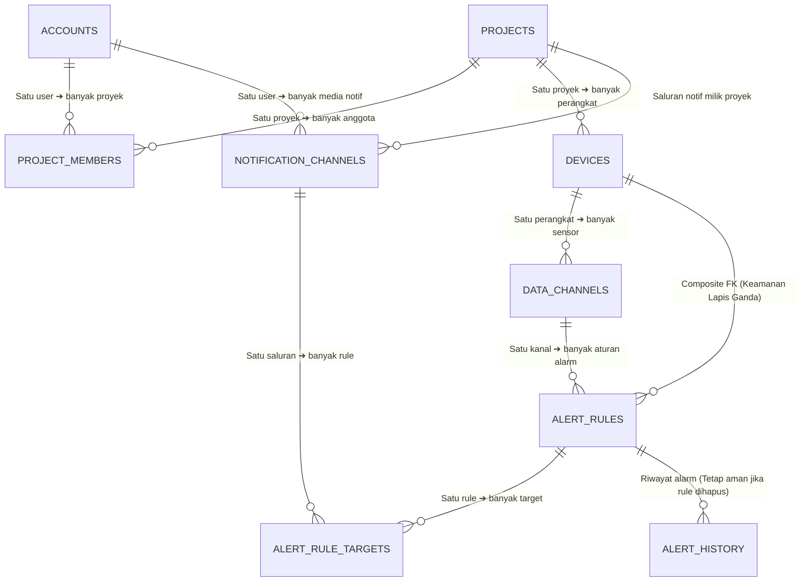

# 📘 Penjelasan Mendalam Arsitektur & Relasi Database Modul A

Dokumen ini berisi panduan penjelasan menyeluruh (*comprehensive guide*) mengenai rancangan database Modul A. Dokumen ini dibuat dalam format **narasi penjelasan mendalam** untuk membantu Anda mempresentasikan konsep arsitektur, keunggulan desain, serta poin-poin integrasi yang harus didiskusikan dengan anggota tim lain (Modul B, C, dan D).

---

## 🖼️ 1. Diagram Relasi Database (ERD)

Rancangan database relasional Modul A terdiri dari 9 tabel yang saling terhubung untuk mendukung manajemen tenant, perangkat, dan mesin peringatan (*alert engine*).




---

## 🏠 2. Penjelasan Analogi Arsitektur (Konsep Dasar)

Untuk mempermudah pemahaman tim atau penguji, struktur database ini dirancang dengan prinsip **Co-Working Space (Ruang Kerja Bersama)**:

*   **Pemisahan Wilayah (Tenant Boundary)**: Proyek (`projects`) bertindak sebagai ruangan kantor yang disewa. Pengguna (`accounts`) memiliki akses masuk berupa kartu akses (`project_members`). Seseorang bisa memiliki akses ke beberapa ruangan, dan satu ruangan bisa diakses beberapa orang.
*   **Perangkat & Sensor**: Di dalam ruangan kantor tersebut, terpasang perangkat (`devices`) seperti AC pintar. AC pintar ini memiliki sensor suhu (`data_channels`).
*   **Logika Alarm**: Saklar pengaman otomatis (`alert_rules`) dipasang pada sensor suhu AC tersebut agar jika suhu ruangan melewati batas, ia mengirimkan sinyal bahaya ke kabel penghubung (`alert_rule_targets`) yang mengarah ke nomor darurat Telegram/Email (`notification_channels`).
*   **Buku Catatan Keamanan**: Satpam (`alert_history`) mencatat setiap kali alarm berbunyi secara instan agar jika saklar alarm dirusak atau dihapus, riwayat kejadian daruratnya tidak hilang.

---

## ⚡ 3. Penjelasan Detail Keunggulan Teknis Database

Skema database di `schema_modul_a.sql` dirancang agar tidak sekadar menyimpan data, melainkan juga menjaga keamanan data langsung dari tingkat basis data (*database level validation*).

### A. Jaminan Isolasi Tenant Melalui Kunci Komposit
Data antar-proyek tidak boleh tercampur. Untuk mencegah kebocoran data, tabel `devices`, `notification_channels`, `alert_rules`, dan `alert_rule_targets` dikunci menggunakan **Foreign Key Komposit** yang menyertakan `project_id`. 
*   **Mengapa ini unggul?** PostgreSQL akan menolak secara otomatis di tingkat basis data jika ada percobaan memasang aturan alarm dari Project A agar dikirim ke saluran Telegram milik Project B. Hal ini mencegah celah keamanan (*security exploit*) jika ada bug di tingkat kode aplikasi backend.

### B. Denormalisasi Terkendali untuk Performa Tinggi
Alert Engine harus mengevaluasi jutaan data telemetri per detik. Data yang masuk dari Redis Streams hanya menyertakan `device_id`.
*   *Jika dinormalisasi penuh*: Sistem harus melakukan operasi `JOIN` tabel `alert_rules ➔ data_channels ➔ devices` untuk memvalidasi aturan. Ini sangat lambat.
*   *Solusi Desain*: Kita mendenormalisasi kolom `device_id` ke dalam tabel `alert_rules`.
*   *Menjaga Konsistensi*: Agar `device_id` tidak salah isi, dipasang composite foreign key `(channel_id, device_id, channel_type)` yang merujuk ke `data_channels`. Database secara native menjamin bahwa aturan alarm tidak bisa dipasang pada kombinasi device dan channel yang salah.

### C. Pembatasan Kepemilikan Tunggal (Owner) yang Skalabel
Satu proyek dibatasi hanya memiliki maksimal 1 owner. Desain ini menggunakan tabel perantara `project_members` (hubungan M:N) yang ditambahkan **Partial Unique Index** (`uq_accounts_active_email WHERE role = 'owner'`).
*   **Mengapa ini unggul?** Pendekatan umum biasanya menyimpan `owner_id` langsung di tabel `projects`. Namun, cara tersebut kaku. Desain M:N ini menjamin platform siap dikembangkan untuk kolaborator tambahan (`viewer` atau `editor`) di masa mendatang tanpa perlu merestrukturisasi tabel database.

### D. Riwayat Audit yang Durabel (Tahan Hapus)
Ketika pengguna menghapus sebuah aturan alarm, data riwayat kejadian masa lalu di tabel `alert_history` tidak boleh terhapus.
*   **Solusi Desain**: Kita menggunakan `ON DELETE SET NULL` pada kolom `alert_rule_id`.
*   **Trigger Penyelamat**: Dipasang trigger `populate_alert_history_context` yang otomatis membuat salinan kondisi aturan alarm (operator, nilai batas, nama sensor) ke dalam kolom JSONB `rule_snapshot` saat alarm terpicu. Sehingga, meskipun aturan alarmnya sudah dihapus oleh pengguna, riwayat audit tetap lengkap dan tidak rusak.

### E. Otomatisasi Siklus Hidup Data via Triggers
Database memiliki fungsi otomatis (*stored procedures*) yang berjalan saat data dimodifikasi:
1.  **Soft-Delete Proyek**: Saat proyek dinonaktifkan (`deleted_at` diisi), trigger otomatis menonaktifkan semua perangkat dan aturan alarm di bawah proyek tersebut.
2.  **Soft-Delete Perangkat**: Saat perangkat dihapus, trigger otomatis menonaktifkan aturan alarm terkait agar tidak memicu deteksi palsu.

---

## 🤝 4. Rencana Kolaborasi & Integrasi Lintas Modul

Agar sistem dapat terintegrasi secara utuh, berikut adalah poin-poin teknis yang perlu didiskusikan dan disepakati dengan tim pengembang modul lain:

### A. Alur Ingest & Verifikasi Kredensial Perangkat (Koordinasi dengan Modul B)
Rancangan autentikasi perangkat menggunakan API Key harus disinkronkan dengan Protocol Gateway (Modul B):
1.  **Format API Key**: Kita menyepakati format token acak ber-entropi tinggi dengan prefix `tip_live_` (contoh: `tip_live_xxxxx`).
2.  **Hashing SHA-256**: Modul A akan menyimpan hash SHA-256 dari key tersebut ke database (`api_key_hash`). Modul B wajib menghitung hash SHA-256 dari header `X-API-Key` yang dikirim perangkat sebelum dicocokkan ke database/Redis.
3.  **Caching Redis**: Ketika perangkat berhasil diautentikasi pertama kali, data kredensial disimpan ke Redis Cache oleh Modul B dengan format key `device:auth:{sha256_hash_hex}` dan payload JSON:
    ```json
    {
      "device_id": 101,
      "project_id": 1
    }
    ```
    Masa berlaku cache disepakati selama 1 jam (TTL = 3600 detik).
4.  **Mekanisme Revocation**: Jika pengguna menghapus perangkat di Modul A, sistem Modul A akan menghapus data di database sekaligus menghapus kunci cache tersebut di Redis secara instan (`DEL device:auth:{hash}`). Modul B harus mendeteksi hal ini agar akses perangkat langsung terputus secara real-time.

### B. Payload Normalisasi Data (Koordinasi dengan Modul B)
*   Format event data sensor yang dikirim Modul B ke Redis Streams wajib memiliki struktur JSON yang disepakati bersama.
*   Alert Engine Modul A membutuhkan field minimal berupa: `device_id` (ID perangkat), `channel_name` (nama sensor, misal "temperature"), dan `value` (nilai sensor).

### C. Pemetaan Widget Berdasarkan Tipe Kanal (Koordinasi dengan Modul C)
*   Endpoint `GET /api/v1/devices/{deviceId}/channels` Modul A akan mengembalikan jenis tipe data channel (`channel_type`).
*   Modul C (Dashboard) harus memetakan widget berdasarkan tipe ini (misalnya widget grafik suhu hanya untuk `numeric`, widget status pintu untuk `boolean`, dan widget peta lokasi hanya untuk `geo`).

### D. Integrasi Tier Akun untuk Throttling Sandbox (Koordinasi dengan Modul D)
*   Modul D (AI Serving Sandbox) membutuhkan status tier pengguna (`free` / `paid`) untuk membatasi resource pemrosesan model AI.
*   Data ini dapat dibaca oleh Modul D langsung dari database relasional PostgreSQL bersama melalui relasi akun proyek, atau dibagikan melalui Redis Cache untuk efisiensi performa tinggi.
