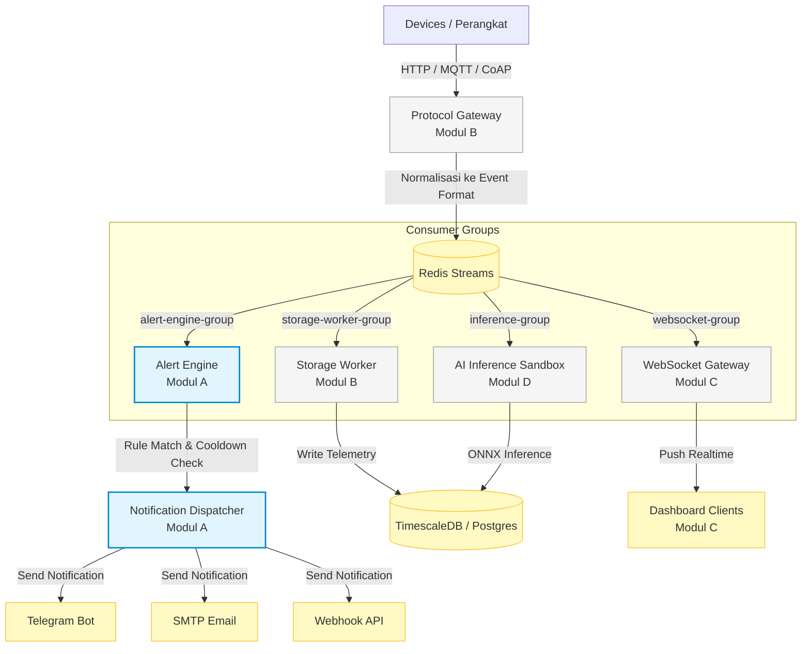

# 📊 Panduan & Analisis Proyek: IoT Platform Multi-Tenant (Fokus Modul A)

Dokumen ini disusun khusus sebagai rujukan untuk **Mahasiswa A** (mengembangkan modul **Authentication, Hierarchy, Alert Engine, dan Notification Dispatcher**). Dokumen ini menyelaraskan arsitektur global sistem dengan tugas spesifik, detail skema database, keputusan desain penting yang harus diambil, serta daftar deliverables Anda.

---

## 🛠️ 1. Arsitektur & Aliran Data End-to-End

Platform IoT ini menggunakan **Event-Driven Architecture (EDA)** berbasis **Redis Streams** untuk memastikan pemrosesan yang ter-decouple. Berikut visualisasi aliran data antar modul:



### 💡 Keputusan Arsitektur Utama (Locked):
* **Tenant Isolation**: Menggunakan **Shared Schema** dengan kolom `tenant_id`/`project_id` di setiap tabel. Tidak memakai database atau skema terpisah untuk meminimalkan overhead koneksi.
* **Decoupled Consumers**: Setiap modul membaca dari Redis Streams menggunakan *Consumer Group* masing-masing secara independen. Lambatnya pemrosesan di Modul D tidak mengganggu deteksi alert Modul A.
* **Hybrid Database**: PostgreSQL untuk data transaksional (user, rules, device metadata) dan TimescaleDB (ekstensi Postgres) untuk data deret waktu (*time-series*) telemetri.

---

## 🎯 2. Ruang Lingkup & Batasan Modul A

Sebagai pemilik Modul A, fokus utama Anda adalah mengelola **Identitas, Hierarki Data, Evaluasi Threshold, dan Distribusi Notifikasi**.

| Fitur Utama | Tanggung Jawab Modul A | Batasan Modul A (Out-of-Scope) |
| :--- | :--- | :--- |
| **Authentication & Authorization** | <ul><li>Registrasi/login akun manusia (password di-hash dengan **bcrypt** / **Argon2**).</li><li>API Key per akun/proyek untuk akses perangkat (di-hash dengan **SHA-256**).</li><li>Role dasar (`owner` proyek).</li></ul> | ❌ **Bukan** tanggung jawab Anda untuk mengautentikasi koneksi raw protokol (itu tugas Protocol Gateway - Modul B). |
| **Hierarki Data (CRUD)** | <ul><li>Mengelola struktur: `Account ➔ Project ➔ Device ➔ Data Channel`.</li><li>Menjamin isolasi tenant via filter `tenant_id`/`project_id` di setiap query.</li><li>Penerapan `ON DELETE CASCADE` saat penghapusan proyek.</li></ul> | ❌ **Tidak perlu** membuat visualisasi widget dashboard (itu tugas Widget Engine - Modul C). |
| **Alert Rule Engine** | <ul><li>Membaca event telemetri dari Redis Streams (`alert-engine-group`).</li><li>Mengevaluasi threshold sederhana per data point (contoh: `value > 30` atau `value < 10`).</li><li>Validasi tipe data channel (hanya bertipe `numeric` atau `boolean`).</li></ul> | ❌ **Tidak mendukung** kondisi majemuk (seperti `suhu > 40 AND kelembaban < 20`). Cukup threshold tunggal per data point. |
| **Notification Dispatcher** | <ul><li>Mengirimkan notifikasi ke Telegram (Bot API), Email (SMTP), atau Webhook (HMAC Signed).</li><li>Menerapkan mekanisme cooldown per alert untuk mencegah spam.</li></ul> | ❌ **Bukan** tugas Anda untuk menulis data telemetri ke database (itu tugas Storage Worker - Modul B). |

---

## 💾 3. Skema Database Modul A & Penjelasan Keputusan

Berikut adalah skema tabel relasional (PostgreSQL) yang disarankan untuk memenuhi kebutuhan hierarki data dan alerting Modul A:

```
[accounts] ──< [project_members] >── [projects]
                                         │
                                         ▼
                                     [devices]
                                         │
                                         ▼
                                  [data_channels]
                                         │
                                         ▼
   [notification_channels] ──< [alert_rule_targets] >── [alert_rules]
                                                            │
                                                            ▼
                                                     [alert_history]
```

### 📝 Catatan Keputusan Desain Skema:
1. **`project_members` (Relasi M:N)**:
   * Menggunakan *partial unique index* `one_owner_per_project` (`WHERE role = 'owner'`) untuk memastikan saat ini hanya ada maksimal 1 owner per proyek. Namun, desain M:N ini menjamin kemudahan ekspansi jika nanti ingin ditambahkan peran kolaborator (`viewer`/`editor`) tanpa migrasi struktural.
2. **`data_channels.channel_type` (TEXT + CHECK Constraint)**:
   * Menghindari PostgreSQL ENUM bawaan agar jika ada penambahan tipe data channel baru (seperti `audio` atau `vector`), kita cukup mengubah constraint tanpa risiko lock table pada data besar.
3. **`alert_rules` (Denormalisasi `device_id`)**:
   * Menyimpan `device_id` secara langsung di tabel `alert_rules` (walaupun bisa didapatkan via `channel_id`). Ini sengaja dilakukan untuk mengoptimalkan performa query pencarian aturan per perangkat agar tidak memerlukan operasi `JOIN` tambahan.
   * > [!WARNING]  
     > **Konsistensi Data**: Backend wajib memvalidasi bahwa `device_id` yang dimasukkan pada `alert_rules` memang benar merupakan pemilik dari `channel_id` terkait.
4. **`alert_rule_targets` (Junction Table)**:
   * Memisahkan daftar channel notifikasi (`notification_channels`) dari aturan alert (`alert_rules`) untuk memenuhi Bentuk Normal Pertama (1NF), memudahkan pencarian rule berdasarkan target notifikasi, serta menghindari penyimpanan array/JSON mentah yang sulit di-index.

---

## 💡 4. Poin Keputusan Desain yang WAJIB Anda Tentukan

Sebelum memulai pengkodean, Anda harus mendokumentasikan keputusan teknis untuk 3 hal berikut:

### 🤔 Keputusan 1: Mekanisme Cooldown Alert yang Efisien
Evaluasi alert terjadi setiap kali telemetri masuk. Melakukan query ke database PostgreSQL setiap saat untuk mengecek status cooldown akan membebani database.
* **Solusi Rekomendasi**: Menggunakan **Redis TTL Key**.
* **Cara Kerja**: Ketika rule dengan ID `X` terpicu, lakukan perintah Redis:
  ```bash
  SET alert:cooldown:X 1 NX EX [cooldown_seconds]
  ```
  * Jika perintah mengembalikan `OK`, berarti masa cooldown sudah selesai (atau belum pernah terpicu). Lanjutkan proses pengiriman notifikasi.
  * Jika perintah mengembalikan `nil`, abaikan pengiriman notifikasi karena masih dalam masa cooldown.

### 🤔 Keputusan 2: Format API Key Perangkat
Bagaimana perangkat mengautentikasi dirinya ke Protocol Gateway (Modul B)? Karena data ini dibuat oleh Modul A dan dikonsumsi oleh Modul B, formatnya harus disepakati bersama.
* **Pilihan A (Statis Ber-entropi Tinggi)**: Menggunakan token acak panjang (misal: `tip_dev_live_xxxxx`). Disimpan sebagai hash SHA-256 di DB. Gateway (Modul B) dapat mencocokkan hash token ini dengan cache Redis. Mudah di-revoke secara real-time. (Sangat disarankan untuk MVP).
* **Pilihan B (Signed Token / JWT)**: Gateway dapat memverifikasi secara lokal tanpa query DB/Redis, namun pencabutan token instan sebelum masa kedaluwarsa berakhir memerlukan manajemen blacklist yang rumit.

### 🤔 Keputusan 3: Penanganan Crash pada Consumer Redis Streams
* Gunakan pola pembacaan menggunakan **Consumer Groups** (`XREADGROUP`).
* Pastikan melakukan acknowledgment (`XACK`) setelah notifikasi berhasil didelegasikan ke dispatcher.
* Saat aplikasi backend Modul A dinyalakan ulang (*restart*), jalankan query pesan `XPENDING` untuk memproses kembali event yang sempat ter-claim namun belum sempat di-ack sebelum crash.

---

## 📅 5. Timeline Proyek & Manajemen Risiko

Berdasarkan tanggal hari ini (**11 Juli 2026**), kita berada di akhir **Minggu 1**:

```
[Minggu 1: 6-12 Jul]    ➔ Skema DB & Finalisasi Schema Event (KITA DI SINI)
[Minggu 2: 13-19 Jul]   ➔ Setup Postgres, Migrasi, & Auth Dasar
[Minggu 3: 20-26 Jul]   ➔ CRUD Hierarki Lengkap & Integrasi API Key Perangkat
[Minggu 4: 27 Jul-2 Ag] ➔ Rule Engine Dasar (Threshold)
[Minggu 5: 3-9 Agu]     ➔ Cooldown Alert & Notification Dispatcher (Telegram)
[Minggu 6-8: 10-30 Agu] ➔ Integrasi Lintas Modul, Audit Keamanan, Demo & Feature Freeze
```

> [!IMPORTANT]  
> **Risiko Utama (SPOF - Single Point of Failure):**  
> Batas akhir kesepakatan skema event internal dengan tim adalah **9 Juli**. Karena hari ini sudah **11 Juli**, **segera lakukan konfirmasi ke rekan tim (Modul B, C, D) untuk memastikan format event internal Redis Streams sudah dikunci dan disepakati.**

---

## 🤝 6. Matriks Kolaborasi Lintas Modul

| Hubungan Lintas Modul | Poin Koordinasi & Kesepakatan |
| :--- | :--- |
| **Dengan Modul B (Gateway)** | <ul><li>**Format Event**: Pastikan payload event menyertakan data minimal: `device_id`, `timestamp`, dan payload metrics.</li><li>**API Key**: Sepakati format autentikasi API Key perangkat pada Minggu 3.</li></ul> |
| **Dengan Modul C (Dashboard)** | <ul><li>**API Endpoint**: Sediakan endpoint `GET /devices/{id}/channels` yang merespon dengan daftar channel beserta kolom `channel_type` (digunakan Modul C untuk memfilter kesesuaian widget visual).</li><li>**Data Historis**: Sepakati pendelegasian query data historis dari TimescaleDB.</li></ul> |
| **Dengan Modul D (AI Serving)** | <ul><li>**Status Tier**: Beritahu Modul D bahwa status tier akun (`free`/`paid`) dapat dibaca langsung dari database relasional Postgres melalui join tabel atau di-cache di Redis.</li><li>**Kanal Hasil AI**: Alert Engine Anda harus mampu memperlakukan kanal data hasil klasifikasi AI (tipe `text` atau `image`) sama seperti telemetri perangkat fisik biasa.</li></ul> |

---

## 📋 7. Deliverables yang Harus Anda Kumpulkan

Pastikan Anda menyelesaikan 4 berkas/dokumen berikut sebagai bukti penyelesaian Modul A:
1. **Skema Database (ERD)** lengkap untuk hierarki `accounts`, `projects`, `devices`, `data_channels`, `alert_rules`, `notification_channels`, dan `alert_history`.
2. **Spesifikasi API Endpoint** untuk operasi CRUD hierarki data, CRUD alert rule, dan pengelolaan notification channel.
3. **Diagram Alur Pemrosesan Alert**: Aliran asinkron dari pembacaan pesan di Redis Streams ➔ evaluasi threshold ➔ pengecekan cooldown ➔ pengiriman notifikasi.
4. **Dokumen Keputusan API Key Perangkat** yang disepakati bersama Mahasiswa B.

---

> [!TIP]  
> **Apakah Anda ingin kita mulai menyusun draf spesifikasi API endpoint (CRUD hierarki & alert rules) dalam format OpenAPI/Swagger atau Markdown agar siap dijadikan bahan diskusi dan implementasi di Minggu 2?**
