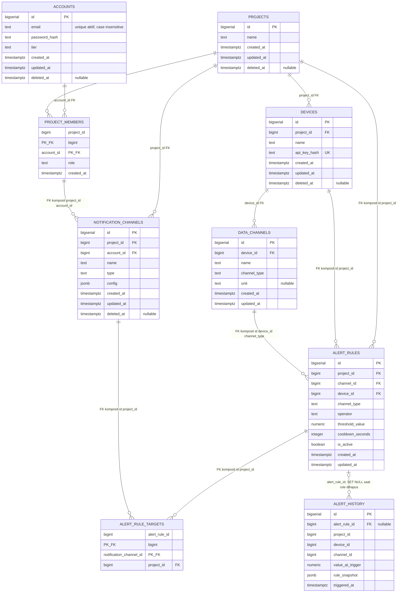

# ERD Modul A — 100% Mengikuti `schema_modul_a.sql`

Dokumen ini adalah sumber ERD utama. Nama tabel, kolom, PK, FK, kolom nullable,
dan aturan relasi di bawah mengikuti skema SQL yang berlaku.

## Aturan yang tidak terlihat langsung sebagai garis ERD

- `accounts.email` unik hanya ketika akun aktif: `lower(email)` dan `deleted_at IS NULL`.
- Satu project hanya boleh punya satu `owner` melalui partial unique index pada `project_members`.
- `devices` memiliki `UNIQUE (id, project_id)`; `data_channels` memiliki `UNIQUE (device_id, name)`, `UNIQUE (id, device_id)`, dan `UNIQUE (id, device_id, channel_type)`.
- `alert_rules` hanya menerima `channel_type = 'numeric'`; `operator` hanya `>`, `<`, `>=`, `<=`, atau `==`; `cooldown_seconds` minimal 1 detik.
- `notification_channels.config` harus JSON object. Pembuat channel harus member dari project yang sama.
- `alert_rule_targets.project_id` mengunci rule dan notification channel dalam project yang sama.
- `alert_history` menyimpan snapshot. Jika rule dihapus, `alert_rule_id` menjadi `NULL`, sedangkan history tidak ikut terhapus.

## Otomasi dan view yang terkait dengan ERD

- Trigger mengisi `updated_at` pada tabel yang memiliki kolom tersebut.
- Trigger soft-delete project menonaktifkan device, notification channel, dan alert rule terkait; soft-delete device menonaktifkan alert rule miliknya.
- Trigger history mengisi `project_id`, `device_id`, `channel_id`, dan `rule_snapshot` dari alert rule.
- `active_alert_rules` hanya menampilkan rule aktif pada project/device aktif dan channel numeric.
- `active_alert_rule_targets` hanya menampilkan target notification channel yang belum soft-delete.
